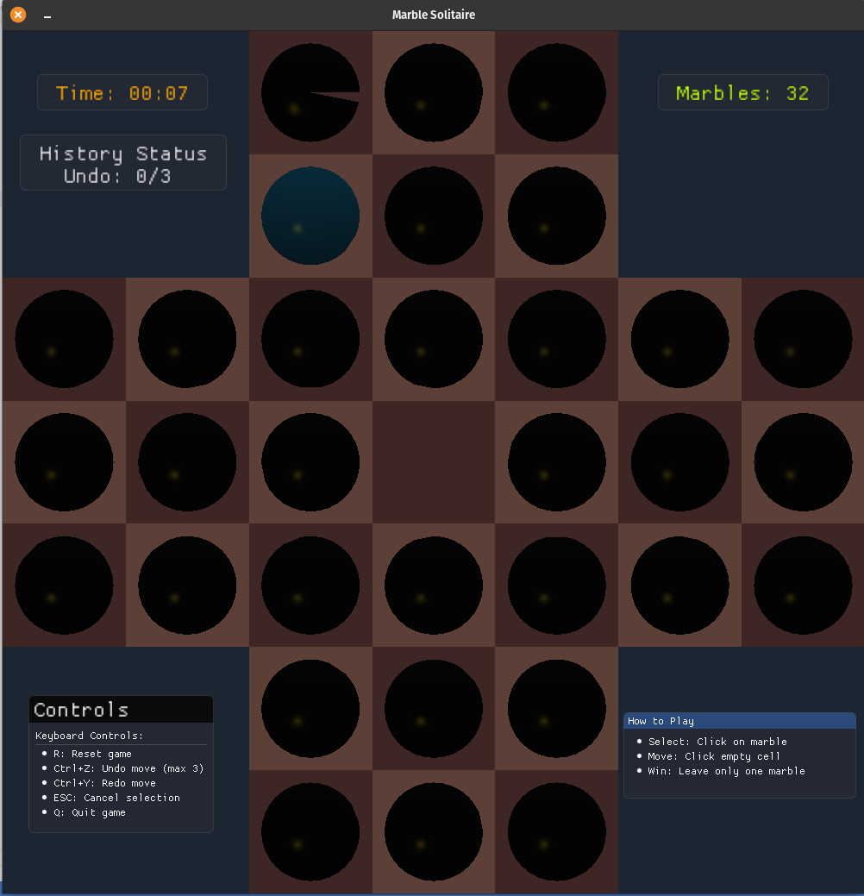

# MarbleMaster 🎮✨


**MarbleMaster** is an implementation of the classic Marble Solitaire game (also known as Peg Solitaire) using OpenGL for rendering and ImGui for the user interface elements. The game features a complete undo/redo system with limits, visual feedback for player actions, and comprehensive game state management.

## Game Screenshot 📸


---

## Author 🧑‍💻

**Shreyas Mehta (2023101059)**

## Index 📚
- [Overview](#overview)
- [File Structure](#file-structure)
- [Prerequisites](#prerequisites)
- [Compiling and Running](#compiling-and-running)
- [Game Controls](#game-controls)
- [ImGui Integration](#imgui-integration)
- [Development Observations](#development-observations)
  - [Effort Analysis](#effort-analysis)
  - [Debugging Challenges](#debugging-challenges)
  - [Challenging Components](#challenging-components)
- [Conclusion](#conclusion)

## Overview 🔍
## Overview 🔍
This project implements the classic Marble Solitaire game using OpenGL for rendering and ImGui for the user interface elements. The game features a complete undo/redo system with limits, visual feedback for player actions, and comprehensive game state management.

Developed as part of the Computer Graphics Course at IIIT Hyderabad, this project demonstrates the application of fundamental graphics concepts including:

- 3D rendering with OpenGL
- Shader programming for visual effects
- UI integration through ImGui
- Game state management and user interaction
- Event handling and input processing

The implementation follows modern OpenGL practices with separate vertex and fragment shaders for the board and marbles, creating a visually appealing game experience while maintaining good performance.

## File Structure 📁
```
project_directory/
├── main.cpp               # Main game logic and rendering
├── imgui.ini              # ImGui configuration
├── README.md              # Project documentation
├── Makefile               # Build system
├── explanation.md         # Changes made in shaders + main.cpp
├── include/
│   ├── imgui/             # ImGui library files
│   ├── file_utils.h       # File utilities
│   ├── math_utils.h       # Math utilities
└── shaders/
    ├── shader.vs          # Vertex shader
    ├── shader.fs          # Fragment shader
    ├── marble_shader.vs   # Marble vertex shader
    └── marble_shader.fs   # Marble fragment shader
```

## Prerequisites 🛠️
Before running the game, ensure you have the following libraries installed:
- OpenGL
- GLFW3
- GLEW
- ImGui

On Ubuntu/Debian-based systems, you can install these dependencies with:
```bash
sudo apt-get update
sudo apt-get install libglfw3-dev libglew-dev
```

## Compiling and Running ▶️

The project includes a Makefile for easy compilation. Follow these simple steps:

1. Navigate to the project directory:
```bash
cd path/to/project_directory
```

2. Compile the code using make:
```bash
make
```

3. Run the executable:
```bash
./sample
```

4. To clean up compiled files when you're done:
```bash
make clean
```

## Game Controls 🎮

- **Mouse** 🖱️: Click to select and move marbles
- **Keyboard** ⌨️:
  - **R**: Reset game
  - **Ctrl+Z**: Undo move (limited to 3 moves)
  - **Ctrl+Y**: Redo move
  - **ESC**: Cancel selection
  - **Q**: Quit game

## ImGui Integration 🖼️

ImGui (Immediate Mode GUI) is incorporated into the project to provide an intuitive and responsive user interface. Here's how ImGui is used in the project:

1. **Initialization** 🚀:
   - ImGui is initialized in the `InitImGui()` function which sets up the context and style.
   - The implementation uses GLFW and OpenGL 3 backends for rendering.

2. **User Interface Elements** 📊:
   - **Game Statistics**: Time elapsed and remaining marbles displayed in the top corners.
   - **History Status**: Shows the current undo/redo stack state.
   - **Game Controls**: Lists keyboard shortcuts and controls.
   - **Game Instructions**: Explains how to play the game.
   - **Status Messages**: Displays notifications when undo/redo limits are reached.
   - **Win/Loss Messages**: Shows game outcome when the game is over.

3. **Rendering Process** 🎨:
   - ImGui elements are rendered in the `RenderImGui()` function which is called each frame.
   - The function creates window elements, arranges them on screen, and handles their appearance.
   - Transparent windows with rounded corners enhance the modern look of the interface.

4. **Styling** 💅:
   - Custom colors and styles are applied to make the UI visually appealing.
   - Different font scales are used for various UI elements to enhance readability.
   - Window transparency and colors are used to create a cohesive visual experience.

## Development Observations 🔬

### Effort Analysis ⏱️

1. **Game Logic Implementation** 🧩:
   - Implementing the core game mechanics was straightforward but required careful state management.
   - The most challenging aspect was ensuring all possible game states were handled correctly.

2. **OpenGL Setup and Rendering** 📐:
   - Creating and managing vertex buffers for the board and marbles was complex.

3. **Undo/Redo System** ↩️:
   - Implementing a limited undo/redo system required careful stack management.
   - Ensuring the correct behavior when adding new moves required special attention.
   - Managing the interaction between stacks while maintaining move limits added complexity.

4. **ImGui Integration** 🔄:
   - ImGui was relatively straightforward to integrate once the basic structure was understood.
   - Creating a visually appealing UI with appropriate positioning took some experimentation.
   - Managing interaction between ImGui and game logic was simpler than anticipated.

### Debugging Challenges 🐛

1. **Marble Positioning** 📏:
    - Initially, marbles were rendered behind the board, making them invisible.
    - Debugging this issue took significant time and involved checking the depth buffer settings and draw order.
    - Adjusting the z-values and ensuring correct rendering order resolved the issue.

### Challenging Components 💪

1. **3D Rendering** 🎲:
   - Creating a visually appealing 3D board with proper lighting and perspective was challenging.
   - Handling marble selection and highlighting required custom shader implementation.

2. **Move Validation** ✅:
   - Implementing proper move validation while maintaining game rules took careful consideration.
   - Detecting game-over conditions required thorough testing.

3. **UI Responsiveness** ⚡:
   - Ensuring the UI remained responsive and informative without cluttering the screen was a balancing act.
   - Designing notifications that were visible but not intrusive required multiple iterations.

## Conclusion 🏁

This project successfully implements the Marble Solitaire game with a modern UI using ImGui and OpenGL. The limited undo/redo system enhances gameplay while maintaining challenge. The visual feedback and game state management provide a polished user experience.

The most significant efforts went into implementing the OpenGL rendering pipeline and ensuring correct game state management, particularly for the undo/redo system. ImGui proved to be a powerful and relatively easy-to-use tool for creating an interactive UI that enhances the overall user experience.

---

## Next Steps/Improvements 🚀

- **Enhanced Visuals**: Add more detailed textures and lighting effects for the board and marbles
- **Animation System**: Implement smooth animations for marble movements and captures
- **Difficulty Levels**: Add different board layouts and difficulty settings
- **Statistics Tracking**: Keep track of player performance across multiple games
- **Save/Load System**: Allow players to save their progress and continue later
